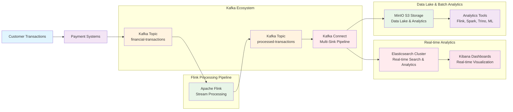
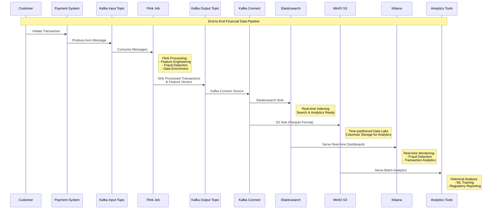
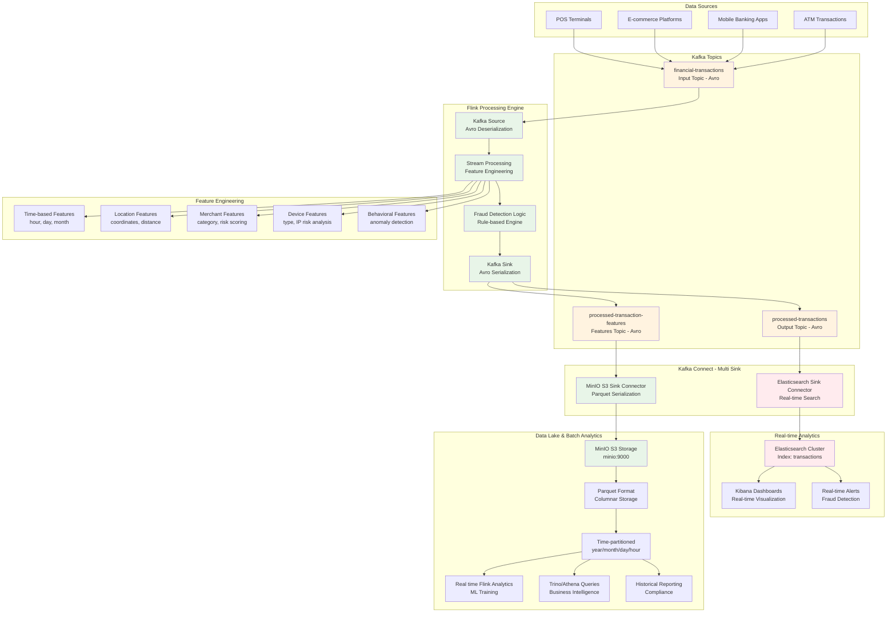

# Flink Avro Kafka Pipeline with Elasticsearch & MinIO S3 Integration

A comprehensive Apache Flink project that consumes Avro-serialized financial transactions from a Kafka topic and sinks them to another Kafka topic, with dual integration to Elasticsearch for real-time analytics and MinIO S3 for data lake storage.

## Architecture Overview



## Complete Data Pipeline



## Enhanced Pipeline Data Flow



## Key Updates in This Pipeline

### 1. **Enhanced Feature Engineering**
The Flink pipeline now includes comprehensive feature extraction:

- **Time-based Features**: hour, dayofweek, month, day extraction from timestamps
- **Location Features**: merchant coordinates, city population, distance calculations
- **Merchant Features**: category encoding, risk scoring based on merchant type
- **Device Features**: device type encoding, IP risk analysis
- **Behavioral Features**: anomaly detection based on transaction patterns

### 2. **Dual Output Topics**
- **`processed-transactions`**: Fraud detection results with processing status
- **`processed-transaction-features`**: Extracted feature vectors for ML training

### 3. **Avro Serialization Throughout**
All Kafka topics use Avro serialization with Schema Registry for:
- Schema evolution compatibility
- Efficient binary serialization
- Schema validation and governance

### 4. **MinIO S3 Integration**
- **Endpoint**: `minio:9000`
- **Format**: Parquet for optimal analytical performance
- **Partitioning**: Time-based partitioning (year/month/day/hour)
- **Use Case**: Data lake storage for batch analytics and ML training

### 5. **Elasticsearch Sink Connector**
- Real-time indexing of processed transactions
- Kibana integration for real-time dashboards
- Fraud detection alerting and monitoring

## Prerequisites

- Java 11 or higher
- Apache Maven 3.6+
- Apache Kafka 2.8+ with Kafka Connect
- Confluent Platform (recommended for Kafka Connect and Schema Registry)
- Elasticsearch 7.x or 8.x
- MinIO S3-compatible object storage (minio:9000)
- Kibana (optional, for visualization)

## Quick Start

### 1. Clone and Build

```bash
git clone https://github.com/martourez21/flink-datastream-pipeline.git
cd flink-datastream-pipeline
mvn clean package
```

### 2. Start Infrastructure Services

```bash
# Start Kafka with Kafka Connect
confluent local services start

# Start MinIO (using Docker) - Updated endpoint
docker run -d --name minio-datalake \
  -p 9000:9000 -p 9001:9001 \
  -e "MINIO_ROOT_USER=minio" \
  -e "MINIO_ROOT_PASSWORD=minio123" \
  minio/minio:latest server /data --console-address ":9001"

# Start Elasticsearch (using Docker)
docker run -d --name elasticsearch \
  -p 9200:9200 -p 9300:9300 \
  -e "discovery.type=single-node" \
  -e "xpack.security.enabled=false" \
  docker.elastic.co/elasticsearch/elasticsearch:8.11.0

# Start Kibana (optional)
docker run -d --name kibana \
  -p 5601:5601 \
  --link elasticsearch:elasticsearch \
  docker.elastic.co/kibana/kibana:8.11.0
```

### 3. Create Kafka Topics

```bash
# Create input and output topics
kafka-topics.sh --create --topic financial-transactions \
  --bootstrap-server localhost:9092 --partitions 1 --replication-factor 1

kafka-topics.sh --create --topic processed-transactions \
  --bootstrap-server localhost:9092 --partitions 1 --replication-factor 1

kafka-topics.sh --create --topic processed-transaction-features \
  --bootstrap-server localhost:9092 --partitions 1 --replication-factor 1
```

### 4. Configure Sink Connectors

#### Elasticsearch Sink Connector

```json
{
  "connector.class": "io.confluent.connect.elasticsearch.ElasticsearchSinkConnector",
  "type.name": "_doc",
  "behavior.on.null.values": "ignore",
  "topics": "processed-transactions",
  "tasks.max": "1",
  "batch.size": "1000",
  "connection.timeout.ms": "5000",
  "max.retries": "10",
  "key.ignore": "true",
  "max.in.flight.requests": "5",
  "retry.backoff.ms": "1000",
  "max.buffered.records": "10000",
  "schema.ignore": "true",
  "behavior.on.malformed.documents": "warn",
  "value.converter.schema.registry.url": "http://schemaregistry0-01:8081",
  "key.converter.schemas.enable": "false",
  "flush.timeout.ms": "10000",
  "name": "elasticsearch-pipeline-sink",
  "value.converter.schemas.enable": "false",
  "connection.url": "http://elasticsearch:9200",
  "value.converter": "io.confluent.connect.avro.AvroConverter",
  "key.converter": "org.apache.kafka.connect.storage.StringConverter",
  "read.timeout.ms": "5000",
  "linger.ms": "100"
}
```

#### MinIO S3 Sink Connector (Parquet Format) - Updated for Features Topic

```json
{
  "connector.class": "io.confluent.connect.s3.S3SinkConnector",
  "behavior.on.null.values": "ignore",
  "s3.region": "us-east-1",
  "flush.size": "1000",
  "tasks.max": "1",
  "s3.part.size": "5242880",
  "timezone": "UTC",
  "max.retries": "10",
  "rotate.interval.ms": "60000",
  "locale": "en-US",
  "retry.backoff.ms": "1000",
  "format.class": "io.confluent.connect.s3.format.parquet.ParquetFormat",
  "s3.ssl.enabled": "false",
  "aws.access.key.id": "minio",
  "value.converter": "io.confluent.connect.avro.AvroConverter",
  "s3.bucket.name": "processed-transaction-features",
  "key.converter": "org.apache.kafka.connect.storage.StringConverter",
  "partition.duration.ms": "3600000",
  "topics": "processed-transaction-features",
  "parquet.codec": "snappy",
  "store.url": "http://minio:9000",
  "aws.secret.access.key": "minio123",
  "behavior.on.malformed.documents": "warn",
  "value.converter.schema.registry.url": "http://schemaregistry0-01:8081",
  "key.converter.schemas.enable": "false",
  "partitioner.class": "io.confluent.connect.storage.partitioner.TimeBasedPartitioner",
  "name": "minio-s3-sink-parquet-features",
  "value.converter.schemas.enable": "false",
  "storage.class": "io.confluent.connect.s3.storage.S3Storage",
  "path.format": "'year'=YYYY/'month'=MM/'day'=dd/'hour'=HH",
  "timestamp.extractor": "Record"
}
```

Register the connectors:

```bash
# Register Elasticsearch connector
curl -X POST -H "Content-Type: application/json" \
  --data @elasticsearch-sink.json \
  http://localhost:8083/connectors

# Register MinIO S3 connector for features
curl -X POST -H "Content-Type: application/json" \
  --data @minio-s3-sink-features.json \
  http://localhost:8083/connectors
```

## Running the Pipeline

### 1. Start Flink Application

```bash
# Run the application
mvn exec:java -Dexec.mainClass="com.codedstreams.flinkpipeline.FlinkDataStreamPipelineApplication"

# Or submit to Flink cluster
flink run target/flink-datastream-pipeline-1.0-SNAPSHOT.jar
```

### 2. Test Data Flow

1. **Produce sample transactions to input topic**:

```bash
kafka-avro-console-producer \
  --broker-list localhost:9092 \
  --topic financial-transactions \
  --property value.schema='{"type":"record","name":"CardTransaction","namespace":"com.codedstream.transfruad.library.schema","fields":[{"name":"transactionId","type":"string"},{"name":"transactionAmount","type":"double"},{"name":"currency","type":"string"},{"name":"timestamp","type":"long"},{"name":"merchantId","type":"string"},{"name":"customerId","type":"string"}]}' \
  --property schema.registry.url=http://localhost:8081
```

2. **Input sample data**:
```json
{"transactionId": "txn-001", "transactionAmount": 100.50, "currency": "USD", "timestamp": 1698765432000, "merchantId": "merch-001", "customerId": "cust-001"}
{"transactionId": "txn-002", "transactionAmount": 250.75, "currency": "EUR", "timestamp": 1698765433000, "merchantId": "merch-002", "customerId": "cust-002"}
```

### 3. Verify Dual Integration

#### Check Elasticsearch Integration

```bash
# Check if index was created
curl -X GET "localhost:9200/_cat/indices?v"

# Search for transactions
curl -X GET "localhost:9200/processed-transactions/_search?pretty"

# Check connector status
curl -X GET "localhost:8083/connectors/elasticsearch-sink-transactions/status"
```

#### Check MinIO S3 Integration

```bash
# Check if bucket exists and has data
docker exec minio-datalake mc ls myminio/processed-transaction-features/

# Check connector status
curl -X GET "localhost:8083/connectors/minio-s3-sink-parquet-features/status"

# View Parquet file structure
docker exec minio-datalake mc ls myminio/processed-transaction-features/year=2025/month=10/day=15/
```

## Feature Engineering Details

### Extracted Features
The Flink pipeline performs real-time feature engineering including:

- **Temporal Features**: Hour, day of week, month, day extraction
- **Geospatial Features**: Merchant coordinates, distance calculations
- **Categorical Encoding**: Merchant categories, device types as numerical features
- **Risk Scoring**: Merchant risk, IP risk, device risk calculations
- **Behavioral Indicators**: Transaction amount patterns, time-based anomalies

### Output Schema
The `ProcessedTransactionFeatures` Avro schema includes:
- Transaction identifiers and timestamps
- All engineered features as float values
- Fraud labels for ML training
- Geographic and demographic placeholders

## Monitoring the Pipeline

### Flink Job Monitoring
- **Flink Web UI**: http://localhost:8081
- **Checkpoints**: Monitor checkpoint success rates
- **Throughput**: Track records processed per second
- **Feature Engineering**: Monitor feature extraction performance

### Kafka Monitoring
- **Topic Metrics**: Monitor lag and throughput across all topics
- **Connect Status**: Check connector health and task status
- **Schema Registry**: Monitor schema compatibility and evolution

### Elasticsearch Monitoring
- **Kibana**: http://localhost:5601
- **Index Health**: Monitor index size and document count
- **Search Performance**: Track query response times for real-time dashboards

### MinIO S3 Monitoring
- **MinIO Console**: http://localhost:9001
- **Bucket Metrics**: Monitor storage usage and object count
- **Data Lake Health**: Track Parquet file organization and partitioning
- **Feature Storage**: Monitor feature vector storage for ML pipelines

## Use Cases

This enhanced pipeline serves as the foundation for:

### Real-time Use Cases (Elasticsearch)
- **Real-time Fraud Detection**: Immediate pattern recognition and alerts using feature vectors
- **Live Transaction Monitoring**: Real-time dashboards with enriched feature data
- **Customer Behavior Analysis**: Instant insights into spending patterns with engineered features
- **Operational Metrics**: Real-time system health and feature engineering performance

### Batch Analytics Use Cases (MinIO S3)
- **ML Model Training**: Feature vectors stored in Parquet format for training fraud detection models
- **Historical Analytics**: Analyze feature patterns and transaction behaviors over time
- **Feature Store**: Centralized repository of engineered features for model reproducibility
- **Regulatory Compliance**: Long-term audit trail of features and transactions
- **Business Intelligence**: Power BI/Tableau dashboards with historical feature data
- **Data Science**: Exploratory data analysis on feature distributions and correlations

## Data Storage Strategy

| Storage | Format | Use Case | Retention | Performance |
|---------|--------|----------|-----------|-------------|
| **Elasticsearch** | JSON Documents | Real-time Search & Analytics | 30-90 days | Sub-second queries |
| **MinIO S3** | Parquet Files | Feature Store & Historical Analysis | 7+ years | Cost-effective storage |

## Troubleshooting

### Common Issues

1. **Schema Compatibility Errors**: Check Schema Registry for existing schemas and compatibility settings
2. **Feature Engineering Failures**: Verify all required fields are present in source transactions
3. **MinIO Connection Issues**: Ensure MinIO is accessible at `minio:9000` with correct credentials
4. **Kafka Connect Sink Failures**: Check connector configurations and topic permissions
5. **Avro Serialization Errors**: Verify Schema Registry connectivity and schema evolution compatibility

### Logs Location
- **Flink Logs**: `$FLINK_HOME/log/`
- **Kafka Connect Logs**: `$KAFKA_HOME/logs/connect.log`
- **Elasticsearch Logs**: Docker container logs or `/var/log/elasticsearch/`
- **MinIO Logs**: Docker container logs
- **Schema Registry Logs**: `$CONFLUENT_HOME/logs/schema-registry.log`

## Development

### Project Structure
```
flink-datastream-pipeline/
├── src/main/java/com/codedstreams/flinkpipeline/
│   └── FlinkDataStreamPipelineApplication.java
├── src/main/resources/
│   └── log4j2.properties
├── connector-configs/
│   ├── elasticsearch-sink.json
│   └── minio-s3-sink-features.json
├── pom.xml
└── README.md
```

### Adding New Features
1. Extend the Avro schema for additional transaction fields
2. Add new feature extraction logic in the `FeatureExtractor` class
3. Configure additional Kafka Connect sinks for other destinations
4. Implement custom Kibana dashboards for feature monitoring
5. Add ML model serving integration for real-time predictions

## License

This project is for demonstration purposes and can be used as a template for enterprise-grade financial data streaming pipelines with comprehensive feature engineering and dual storage strategy for both real-time and batch analytics.

---

**Maintained by**: Nestor Martourez  
**Contact**: nestorabiawuh@gmail.com  
**Professional Profile**: [LinkedIn](https://www.linkedin.com/in/nestor-abiangang/)